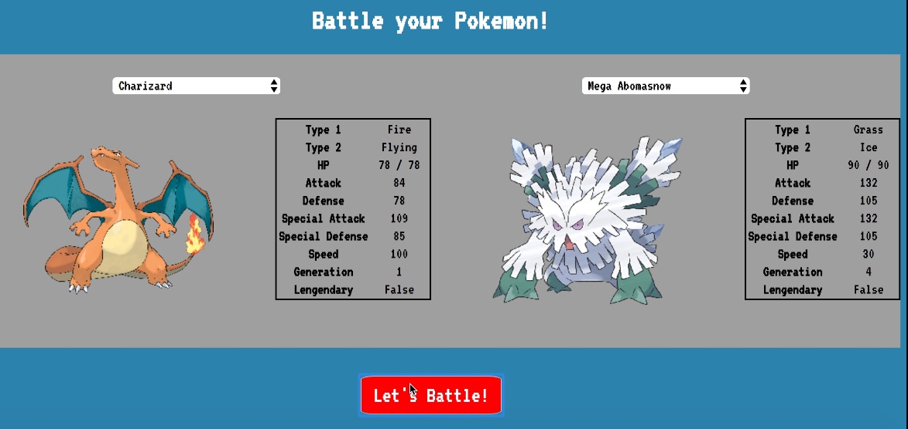
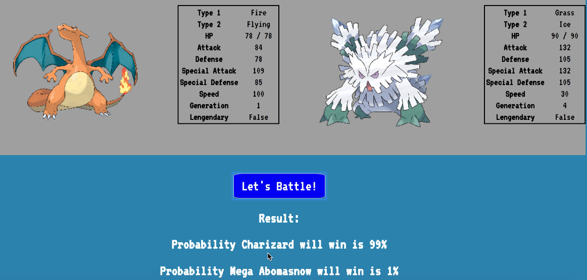

<h2> We Predicted That </h2>
<h3> Welcome to We Predicted That's machine learning excellence! </h3>

  <a href='#introduction'>Introduction</a> |  <a href='#description'>Description</a>   |   <a href='#approach'>Approach</a> | <a href='#screenshots'>Screen Shots</a>  | <a href='#mvp'> MVP</a> |  <a href='#mvp'> Features</a> |  <a href='#tech'>Technologies </a> | <a href='#installation'>Installation </a> |  <a href='https://www.youtube.com/watch?v=TXqf9PLbCds&feature=youtu.be'> Demo video </a> | <a href='https://medium.com/@wepredictedthat'> Blog </a> 


## Introduction  <a name= "introduction"></a>

This repo details We Predicted That's "final week" machine learning project from the December 2017 Makers Academy cohort.

Our team:

- [Reena  Sharma](https://github.com/reenz)
- [Ed Litten](https://github.com/ealitten)
- [Tom Grand](https://github.com/Tagrand)
- [Ed Goold](https://github.com/Gleoman)
- [Dom Vernon](https://github.com/domvernon)

## Project Description <a name= "description"></a>

We defined our initial project aim as:
```
Making predictions using machine learning
```

Since we were all new to machine learning and data science, we started the project with a mini learning project: [predicting who survives the sinking of the Titanic](https://www.kaggle.com/c/titanic). This is a popular starting project for ML, and is a good introduction to the simpler ML algorithms. The challenge is a relatively straightforward binary classification problem - there are two outcomes: survived and died. We solved this using a logistic regression algorithm, using three columns from the Titanic dataset (`age`, `sex` and `passenger class`), achieving 80-82% accuracy of prediction. The titanic model and data can be found in the `titanic` folder.

Once we had solved the titanic challenge, we chose a main project: using a dataset of pokemon attributes and battles to predict the winner in a battle between any two Pokemon. The [dataset](https://www.kaggle.com/terminus7/pokemon-challenge) was obtained from kaggle.

Have a look at the [website](https://we-predicted-pokemon.herokuapp.com) and make as many guesses until your heart is content. (Please note the cloud can be slow to load so you may need to click the lets fight button and wait a sec when you first use it, but after that it will be great.)


## Approach <a name= "approach"></a>

Details on the technical implementation:

1. [Intro to Machine Learning & terminology](https://github.com/ealitten/we-predicted-that/blob/master/docs/terminology.md)
2. [Data munging](https://github.com/ealitten/we-predicted-that/blob/master/docs/data_munging.md)
3. [Training the model](https://github.com/ealitten/we-predicted-that/blob/master/docs/training.md)
4. [Exporting and uploading the model to Google ML engine](https://github.com/ealitten/we-predicted-that/blob/master/docs/exporting_upload.md)
5. [Building a web app in Django](https://github.com/ealitten/we-predicted-that/blob/master/docs/django.md)
6. [Linking up the web app on Heroku with the model](https://github.com/ealitten/we-predicted-that/blob/master/docs/heroku_ml_engine.md)

Have a look at our [team blog](https://medium.com/@wepredictedthat) for the teamwork side of things!


## Demo <a name= "screenshots"></a>

The pokemon predictor webiste is hosted on Heroku at https://we-predicted-pokemon.herokuapp.com/

N.B. On the free tier, Google ML engine nodes sleep after a few minutes without any requests. This means the first time you ask for a prediction, the node needs to be spun up and the response may be slow (~30s); however, subsequent requests should have more normal performance (<1 second).

#### Pick two Pokemon and see who will win

<a href='https://www.youtube.com/watch?v=TXqf9PLbCds&feature=youtu.be'> Watch a demo video </a> 

  




## MVP <a name= "mvp"></a>

We defined our learning project MVP as:
```
Using Titanic survivor data, predict the survival outcome of passengers better than chance (50%).
```

The MVP for our main project was defined as:
```
Using the battle data and Pokemon attributes, predict the outcome of a battle with accuracy >75%
```


## Features implemented  <a name= "features"></a>

- A pokemon battle model which predicts the outcome of a fight between two pokemon
  - Logistic regression method used for prediction
  - Accuracy of ~87%
  - Trained on a dataset of 40,000 outcomes, using 16 feature columns
  - Model hosted on Google ML engine for online prediction requests

- A web app which provides an interface for the prediction model
  - The user can select two pokemon to fight and see the predicted outcome
  - The user can see images of the pokemon, and see their stats before the battle


## Technologies / plaforms used  <a name= "tech"></a>

- Python
- [TensorFlow](https://www.tensorflow.org) - Machine learning library
- [Pandas](https://pandas.pydata.org) - Data structure library
- [Django](https://www.djangoproject.com/) - Python web framework
- [Google ML engine](https://cloud.google.com/ml-engine/) - Managed service to host custom machine learning model
- [Heroku](https://www.heroku.com/) - Platform to deploy our Django web app


## Installation/Requirements <a name= "installation"></a>

- python 3.6

All required packages can be installed by installing the pipenv library (`pip install pipenv`) and then running `pipenv install` in the project directory. This will create a virtual environment with the dependencies installed - to run commands in the environment first run `pipenv shell`. By default, pipenv will only install production packages (required for the Django website) - to install packages required to build the tensorflow model, use `pipenv install --dev`.
